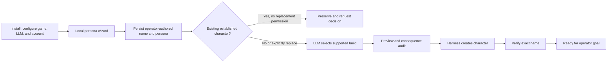

# Implementation and operations

This document describes the implemented runtime. Normative behavior belongs in
the [requirements package](requirements/README.md); installation details belong
in the [operations runbook](requirements/operations.md).

## Runtime topology

The controller is a companion process, not a harness fork. The harness is pinned
directly to the authoritative public upstream as a Git submodule at tested revision
`1cf3ac93da96f1a5c31b7c8463e73d1af97b534e`.

| Surface | Default | Access |
|---|---:|---|
| Harness broker | `127.0.0.1:8901` | Ordinary game-protocol actions; loopback only. |
| Controller API | `127.0.0.1:8903` | Authenticated mutations and status; loopback only. |
| Dashboard | `127.0.0.1:8904` | Redacted, read-only status. LAN exposure is opt-in. |
| `meridian_bot` MCP | stdio | Persona, goals, proposals, events, and supervision. |
| `meridian_knowledge` MCP | stdio | Read-only grounded game facts and validation. |
| Local terminal console | loopback API | Live character/goal monitoring and authenticated goal management. |
| LLM endpoint | `127.0.0.1:8000/v1` | Configurable OpenAI-compatible API. |
| Game server | `127.0.0.1:5959` | Configurable ordinary player connection. |

The planner sees typed ordinary-game capabilities and selects at most one action
per turn. It never receives account lifecycle, raw controller, fleet, recording,
conversation-inbox, or secret-management tools. The adapter validates arguments,
injects the configured agent identity, records policy decisions and prepared
attempts, and serializes mutations.

Conversation is an independent, tool-less LLM role. Player/NPC text is untrusted
roleplay and cannot mutate goals or controller state. Bounded proactive greetings
and per-speaker history are optional. Chat generation uses a separate temperature
from planning, and a deterministic rolling window limits each speaker conversation
to 12 total incoming/outgoing lines in 30 minutes by default.

## First-run state machine



The durable onboarding record is separate from the goal queue. A first-run
placeholder matching `User` plus digits can be replaced automatically. Any
other differently named character is preserved until a persona update includes
`replace_existing_character=true`. The LLM chooses from harness-supported stat
and loadout presets; the controller previews and audits the destructive reroll,
then verifies the exact desired name. It does not create a gameplay goal.
The installer invokes the local `setup-persona` command before launching the
controller, so this state machine does not depend on a frontier supervisor or an
MCP host. The configured runtime model is used only for the supported build
selection and later bot roles; it does not invent the persona.

## Major components

- `controller.py`: onboarding, observe-plan-authorize-execute-verify loop,
  campaign coordination, deterministic completion, and supervision projection.
- `storage.py`: SQLite/WAL durable state and request idempotency.
- `model.py`: OpenAI-compatible goal drafting, planning, onboarding, conversation, and journal
  assessment roles with explicit unauthenticated, Bearer, and Anthropic header
  modes.
- `policy.py`: hard authority separation and non-blocking consequence audits.
- `broker.py`: harness JSON-RPC adapter and managed broker lifecycle.
- `campaign.py`, `learning.py`: persistent internal phases, circuit breakers,
  lessons, and deterministic retry predicates.
- `knowledge.py`, `knowledge_mcp.py`: versioned compendium index, provenance,
  resolution, progression context, and goal validation.
- `api.py`, `mcp.py`: authenticated local API, read-only dashboard, and MCP facade.
- `tui.py`: color-coded polling dashboard, human-readable complete on-demand
  character view, model-draft review loop, goal/queue management client, and
  immediate Escape-to-cancel navigation across nested screens and prompts.
- `pvp.py`: bounded controller-owned tactical composites using fresh local state.
- `notifications.py`, `obsidian.py`: asynchronous optional notification sinks.
- `simulator.py`: deterministic dependency substitute used by tests.

## Durable execution rules

- Strategic goals survive internal recovery, travel, commerce, equipment,
  training, inventory, and tactical failures.
- The controller verifies completion from typed criteria and observed state, not
  from model assertions.
- Equivalent actions may fail only within bounded budgets. Circuit breakers
  replace an internal phase or create a durable lesson without silently changing
  operator intent.
- Ambiguous mutation results are recorded as unknown and reconciled from a fresh
  observation rather than blindly replayed.
- Critical health yields to survival recovery. Foreground ownership and keeper
  ownership are explicit in supervision.
- Consequential actions record a preflight assessment before execution and a
  linked post-action result. They do not wait for interactive approval.
- The controller never uses harness `leave` or deletes fleet state for routine
  recovery.

## Runtime state

The default root is `%LOCALAPPDATA%\m59-llm-bot`:

```text
bot.toml                 # non-secret runtime configuration
secrets.env              # ACL-restricted credentials and tokens
data/controller.sqlite3  # durable controller state
data/harness-fleet-state.json
logs/
run/
```

Treat the whole runtime directory as private. Secrets, control tokens, private
hosts, account data, diagnostics, and game history must not be committed.

## Recovery behavior

- Broker unavailable: no controller mutation; reconnect with bounded backoff.
- Model unavailable: mechanical survival may continue; no new LLM action starts.
- Invalid model output: reject it and retain the strategic goal.
- Invalid/ambiguous game reference: block planning until grounded or corrected.
- Notification failure: retain delivery state for retry without blocking play.
- Process restart: reload durable goals, execution phases, onboarding, lessons,
  and idempotency records from SQLite.

## Verification

Run the offline suite:

```powershell
powershell -NoProfile -ExecutionPolicy Bypass -File .\scripts\test.ps1
```

Run dependency diagnostics against an installed configuration:

```powershell
$env:PYTHONPATH = "$PWD\src"
python -m meridian_bot.cli --config "$env:LOCALAPPDATA\m59-llm-bot\bot.toml" doctor
```

`doctor` validates configuration, the pinned harness, broker access, model
endpoint/model availability, storage, and configured notification paths without
printing secrets. See the [operations runbook](requirements/operations.md) for
installation, update, backup, and uninstall procedures.
