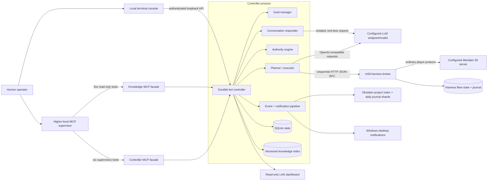

# System architecture

## 1. Architectural shape

The new codebase is a companion control plane above `m59-harness`. The harness
remains responsible for speaking the Meridian 59 protocol and for mechanically
safe game primitives. The controller adds durable goals, LLM planning, authority
checks, recovery, and operator-facing integration.



## 2. Component responsibilities

### 2.1 Harness checkout

The deployment shall use an independent checkout of
[`tpeppers/m59-harness`](https://github.com/tpeppers/m59-harness), pinned directly
to an explicit tested commit. The preferred implementation is a Git submodule at
`vendor/m59-harness`; a configured external checkout is also allowed for local
development.

Rules for the upstream boundary:

- No copied source snapshot and no permanent private fork.
- No controller behavior injected into the harness broker.
- The controller consumes the broker's documented HTTP JSON-RPC/MCP contract and
  reads only documented status/event data.
- If a required game primitive is missing, implement the generic primitive in the
  upstream project with the maintainer, then advance the pinned revision here.
- Keep compatibility checks in an adapter so upstream changes do not spread
  through planner, policy, or goal code.
- Never start a second broker for an account already owned by a broker. Attach to
  the existing process.

### 2.2 Harness broker

The broker owns the sole game connection and provides paced tools such as join,
look, travel, fight, rest, autopilot, history, progress, and fleet status. Its
existing mechanical autopilot is useful for `survive`, `farm`, and `idle`
behaviors, but contains no LLM and does not own product goals.

The broker must retain responsibility for packet rate limits. The controller adds
a stricter rule: only one mutating broker request may be in flight for a
character. Read-after-write verification also remains sequential.

### 2.3 Controller service

The controller is one long-lived process with these internal modules:

| Module | Responsibility |
|---|---|
| Goal manager | Transactional active-goal/queue state machine, proposals, completion evidence, reversible replacement, and a commitment guard against premature active-goal cancellation. |
| Reconciler | Compares durable intent with current broker/game state after start, reconnect, timeout, or ambiguous action result. |
| Planner | Produces bounded next-step plans using the local model and an intentionally small capability set. |
| Executor | Calls one broker action at a time, records request/result, then obtains verification evidence. A bounded controller-owned tactical composite may sequence several such calls while retaining exclusive turn ownership. |
| Authority engine | Deterministically enforces no-cheating rules and attaches non-blocking consequence guidance before execution. The LLM cannot override hard denials. |
| Risk manager | Interrupts goal work for survival, recovery, or safe-idle behavior. Banking remains an informed planner tactic, not a risk-manager gate. |
| PvP coordinator | Filters grounded rooms through indexed combat flags and verified guild eligibility, distinguishes completed patrol coverage from typed route failure, acquires a target from fresh local visibility, and composes positioning, spells, attacks, health checks, disengagement, cleanup, and loot for that exact player. Fresh-local opportunity goals are exact-target `pvp_engage` contracts and expire instead of becoming searches; explicit operator hunts may patrol. It does not change the harness. |
| Conversation responder | Generates social replies in the configured persona without tools or control context. |
| Memory manager | Maintains typed world/character/social facts plus durable goal-failure lessons, deterministic retry predicates, provenance, confidence, and resolution lineage. |
| Knowledge manager | Builds an atomic SQLite/FTS index from the pinned harness compendium, resolves canonical entities, validates goal references, and supplies bounded evidence to the planner. |
| Event pipeline | Writes structured events and fans interesting events to notifier and journal sinks. |
| API/MCP facade | Provides non-LLM status and durable command operations to the supervisor. |

### 2.4 Controller storage

Use SQLite in WAL mode for controller-owned state. Required tables or equivalent
logical collections are:

- `goals` and `goal_transitions`;
- `goal_lessons` for cross-goal failure evidence, scope, retry predicates, and retry/resolution lineage;
- `consequence_assessments` for non-blocking high-impact preflights;
- `plans`, `steps`, and `action_attempts`;
- `observations` and typed `facts`;
- `events` with a monotonic cursor;
- `persona_versions`;
- `notification_deliveries` for exactly-once-per-sink behavior;
- `runtime_leases` for controller singleton ownership; and
- `schema_migrations`.

SQLite stores no account password or API keys. Credentials remain in a private
runtime secret file. The harness may retain its own user-authorized plaintext
`substrate/fleet-state.json`; both paths must be excluded from Git and protected
with user-only filesystem permissions where Windows permits.

### 2.5 Hermes integration

Hermes loads the controller's stdio MCP server through `mcp_servers` in its local
configuration. The MCP process is a thin client: it connects to the loopback
controller API, maps requests to the schemas in [interfaces.md](interfaces.md),
and exits/reconnects without owning game state.

Hermes receives two deliberately separate surfaces: six supervisory tools from
`meridian_bot` and five read-only fact tools from `meridian_knowledge`. It does
not receive the harness's roughly 48 raw game tools.
This keeps the supervisor's prompt/tool surface stable and prevents a conversational
Hermes turn from becoming the 24/7 executor.

Hermes must be restarted into a new session after MCP configuration changes; the
running controller is independent of that restart.

### 2.6 Knowledge and evidence

The authoritative static corpus is generated from the pinned
`vendor/m59-harness/compendium` output and stored at
`data/knowledge.sqlite3`. Each entity includes a canonical id, kind, aliases,
structured facts, source reference, source hash, harness revision, and corpus
version. The build is atomic and repeats only when the input manifest changes.

Evidence priority is: live ordinary-client observation for current state;
pinned source-derived corpus for static game facts; broker catalog results for
live server-specific recommendations; and clearly labelled player/model claims
for hypotheses only. Obsidian is a human-readable event projection, never a fact
source. An exact zero-match is negative evidence for the pinned corpus. The
planner must choose another target or obtain new ordinary-client evidence rather
than inventing a location or retrying the same lookup.

Goal-failure memory is a separate controller-owned evidence path. Equivalent
goals are grouped by normalized deterministic outcome criteria. Goal-scoped
lessons gate submission and proposal acceptance until observed predicates
change; tactic-scoped lessons suppress only the failed action shape. Obsidian is
only a projection of lesson events and cannot change lesson state.

### 2.7 Model service

The controller uses a configured OpenAI-compatible endpoint. Goal-drafter,
planner, and responder requests share the configured endpoint but use separate
prompts, context builders, timeouts, and output validators. None of these roles
depends on Hermes being active. Authentication is explicit: no credential header, HTTP
Bearer for OpenAI/Codex-compatible APIs, or Anthropic `x-api-key` plus
`anthropic-version`. Legacy `auto` mode preserves the original optional-Bearer
behavior.

The model name, base URL, authentication behavior, sampling parameters, and
context budgets are configuration. Startup validates that the configured model
is present and reports a degraded—not corrupt—state when the endpoint is unavailable.

### 2.8 Notifications and journal

The event pipeline supports local sinks through a versioned notifier interface.
Structured events remain deterministic evidence. The MVP sinks are:

1. an Obsidian project index with append-only daily Markdown shards containing
   batched local-LLM assessments of significance, not raw event/error lines; and
2. Windows native desktop notifications for configured severities/kinds, which
   remain deterministic and immediate.

Hermes Desktop has native notifications for its own session events, but no
supported general-purpose external toast endpoint is assumed. A future
Hermes-native sink may be added only through an upstream-supported contract; no
Hermes core patch is required for MVP.

### 2.9 Dashboards

Two read-only views may coexist:

- the harness dashboard for low-level character/broker telemetry; and
- the controller dashboard for goals, policy, LLM health, consequential actions,
  proposals, and events.

They are operational views, not control planes. All buttons or HTTP methods that
mutate game/controller state are absent from LAN listeners.

### 2.10 Local terminal console

The optional terminal console is a control client, not a controller process. It
reads the same compact supervision state used by the MCP facade and sends typed,
versioned goal mutations to the authenticated loopback API. Its lifetime is
independent from the scheduled controller and it never connects to the harness
directly.

## 3. Network and process topology

Recommended defaults:

| Endpoint | Bind | Default | Purpose |
|---|---|---:|---|
| LLM API | configurable | `127.0.0.1:8000` | OpenAI-compatible inference. |
| Harness broker control | loopback | `127.0.0.1:8901` | HTTP JSON-RPC/MCP used by controller. |
| Harness dashboard | loopback by default | `127.0.0.1:8902` | Existing read-only harness view. |
| Controller control API | loopback | `127.0.0.1:8903` | Authenticated local API used by MCP facade and operations. |
| Controller dashboard | loopback by default | `127.0.0.1:8904` | Read-only redacted status and events; LAN is opt-in. |
| Meridian 59 server | configurable | `127.0.0.1:5959` | Ordinary player connection owned by broker. |

All ports are configurable and checked for conflicts before start. Binding a
control endpoint to a non-loopback address is a startup error. LAN dashboards
should additionally allow an IP allowlist; authentication may be added but does
not convert them into mutation surfaces.

## 4. Primary data flows

### 4.1 First-run onboarding

```mermaid
sequenceDiagram
    participant User as Human operator
    participant Supervisor
    participant C as Controller
    participant LLM as Configured LLM
    participant B as Harness broker

    User->>C: Configure game and LLM endpoint/model
    C-->>Supervisor: onboarding=awaiting_persona
    User->>Supervisor: Desired name and persona
    Supervisor->>C: set_persona(versioned request)
    C->>B: Observe existing character
    alt Established different identity without replacement permission
        C-->>Supervisor: Preserve character; request explicit decision
    else New placeholder or explicit replacement
        C->>LLM: Persona and supported build choices
        LLM-->>C: Stat/loadout preset
        C->>B: Preview, audit, create, observe
        B-->>C: Verified exact character name
        C-->>Supervisor: ready_for_goals=true
    end
    User->>Supervisor: Strategic gameplay goal
```

### 4.2 Submit and execute a goal

```mermaid
sequenceDiagram
    participant User
    participant Supervisor
    participant MCP as Controller MCP
    participant C as Controller
    participant LLM as Configured planner
    participant B as Harness broker

    User->>Supervisor: Natural-language objective
    Supervisor->>MCP: submit_goal(structured goal, request_id)
    MCP->>C: Authenticated loopback command
    C->>C: Validate, authorize scope, persist
    C-->>Supervisor: Goal ID, state, version
    loop Until terminal, paused, or blocked
        C->>B: Observe current state
        B-->>C: Typed observation
        C->>LLM: Goal + context + bounded capabilities
        LLM-->>C: Structured next step
        C->>C: Validate schema and policy
        alt Hard no-cheating denial
            C->>C: Persist denial; replan or block
        else Allowed, possibly with caution
            C->>B: Execute one action
            B-->>C: Action result
            C->>B: Verify state if needed
            B-->>C: Evidence
            C->>C: Persist action, evidence, event
        end
    end
```

### 4.3 Incoming player speech

1. Broker emits a chat event.
2. Controller records the raw message in short-retention private telemetry.
3. Sanitizer produces quoted, untrusted conversation content.
4. Responder receives only the persona, sanitized recent conversation, and
   allowed public context.
5. Controller checks the per-speaker rolling conversation window before invoking
   the responder and again before sending a queued reply.
6. Deterministic egress filtering runs.
7. Broker sends the reply subject to chat pacing.
8. Conversation content remains private to responder history and chat
   observability; it is never offered to the planner, keeper, or gameplay loop.

### 4.3 Restart and reconciliation

1. Process obtains a singleton lease.
2. Database migrations and integrity checks run.
3. Controller attaches to the existing broker or starts exactly one configured
   broker instance.
4. Controller reads broker fleet state, current character observation, and last
   incomplete action.
5. Ambiguous actions are verified from game state; they are not blindly replayed.
6. Active goal resumes only after risk and authority checks.
7. Startup/recovery event is emitted, including downtime and reconciled state.

## 5. Failure containment

| Failure | Required behavior |
|---|---|
| LLM timeout/unavailable | Stop new goal actions, engage bounded safe fallback, retain goal, retry with capped backoff, alert after threshold. |
| Broker unavailable | Do not spawn duplicates blindly; inspect singleton/health, reconnect or restart configured broker, then reconcile. |
| Game server unavailable | Preserve state, stop inference hot-looping, retry connection with jittered backoff, alert on outage/recovery. |
| Ambiguous action timeout | Mark attempt `unknown`, observe actual state, classify succeeded/failed/unknown before any retry. |
| Invalid model output | Reject without action, record validation code, retry with compact correction prompt within budget, then safe fallback. |
| Authority violation proposed | Reject deterministically, block or replan, emit audit event. Repeated proposals trigger degraded mode. |
| Database write failure | Stop game mutation immediately; continue only survival behavior that can operate without corrupting durable intent. |
| Notification sink failure | Preserve event, retry sink independently, never block game survival or goal state commits. |
| Dashboard failure | No effect on controller or broker. |

## 6. Compatibility contract

At startup the harness adapter shall interrogate the broker capability/tool list
and compare it with a tested manifest containing:

- harness Git revision or semantic build identifier when available;
- required tool names and input-schema hashes;
- optional capabilities;
- expected protocol/API version; and
- known incompatibilities.

Missing required tools or changed schemas place the controller in `incompatible`
state. Optional capabilities degrade only their associated tactics. The adapter
shall translate harness-specific payloads into internal typed observations so
the rest of the controller does not depend on unstable raw output.
