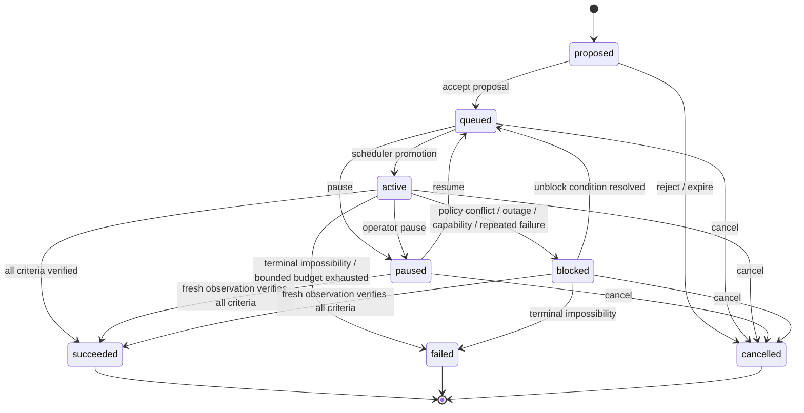

# Interfaces and durable schemas

This document is normative for controller-owned interfaces. Examples use JSON;
timestamps are RFC 3339 with an explicit offset or `Z`. IDs are lowercase UUIDv7
strings unless noted. Unknown fields are rejected on mutation requests and may be
ignored on read responses for forward compatibility.

## 1. Common conventions

- `request_id` is a caller-generated UUID used for idempotency. Repeating a
  request with the same ID and identical body returns the original result.
  Reusing it with a different body returns `IDEMPOTENCY_CONFLICT`.
- `version` is a monotonically increasing integer on a mutable resource. Commands
  may include `expected_version`; a mismatch returns `VERSION_CONFLICT`.
- Machine-readable errors use `{ "code", "message", "retryable", "details" }`.
- No response type contains credentials, control bearer tokens, model secrets,
  private filesystem paths, chain-of-thought, or raw system prompts.
- Human-readable summaries are informational. Callers use enums and typed fields.

## 2. Goal schema

```json
{
  "id": "0198...",
  "version": 4,
  "title": "Earn and bank 2,000 shillings",
  "objective": "Increase safely banked money by at least 2,000 shillings.",
  "success_criteria": [
    {
      "id": "bank_delta",
      "kind": "numeric_delta",
      "metric": "bank.currency.shillings",
      "operator": ">=",
      "value": 2000,
      "baseline": 1450
    }
  ],
  "constraints": {
    "avoid_death": true,
    "bank_before_hazard": true,
    "operator_notes": "Prefer varied activities if one route stalls."
  },
  "priority": 50,
  "status": "active",
  "source": {
    "kind": "hermes",
    "actor": "TestHero",
    "request_id": "0198..."
  },
  "created_at": "2026-08-03T18:30:00-07:00",
  "updated_at": "2026-08-03T18:36:12-07:00",
  "activated_at": "2026-08-03T18:30:01-07:00",
  "terminal_at": null,
  "blocked_reason": null,
  "completion": {
    "percent_estimate": 24,
    "summary": "480 of 2,000 shillings verified as newly banked",
    "evidence_event_ids": ["0198..."]
  }
}
```

### 2.1 Goal field constraints

| Field | Constraint |
|---|---|
| `title` | 1-120 Unicode characters; supplied or deterministically derived. |
| `objective` | 1-4,000 characters; imperative outcome, not a sequence of raw tool calls. |
| `success_criteria` | 1-20 criteria. Each must define an observable verifier or explicitly use `operator_confirmed`. |
| `constraints` | Typed controller constraints plus at most 4,000 characters of operator notes. Notes do not override policy. |
| `priority` | Integer 0-100; higher runs first. Emergency survival is an internal interrupt above 100, not a user goal. |
| `source.kind` | `user`, `hermes`, `controller_proposal`, or `recovery`. Player chat is not a valid source. |

Supported criterion kinds in MVP:

- `state_equals`: a typed observed state equals a value;
- `numeric_threshold`: an observed metric crosses a threshold;
- `numeric_delta`: a metric changes from a captured baseline;
- `inventory_contains`: verified inventory has matching item/count;
- `location_reached`: verified room/coordinate/area is reached;
- `event_occurred`: a matching durable event exists after activation;
- `composite_all` or `composite_any`: references other criterion IDs; and
- `operator_confirmed`: requires an explicit completion confirmation and is used
  only where the game provides no observable proof.

Hermes-visible criterion fields are closed by kind; unknown fields are rejected:

| Kind | Required fields | Optional fields | Verification semantics |
|---|---|---|---|
| `state_equals` | `kind`, `path`, `value` | `id` | The JSON value at observation dot-path `path` exactly equals `value`. |
| `numeric_threshold` | `kind`, `metric`, `value` | `id`, `operator` | The observed numeric metric satisfies `operator` (`>=` by default) against `value`. `metric` may be an observation dot path or `ability.skill.<canonical name>` / `ability.spell.<canonical name>`. |
| `numeric_delta` | `kind`, `metric`, `value`, `baseline` | `id`, `operator` | Observed metric minus `baseline` satisfies the comparison against `value`; named ability metrics use the same syntax. |
| `inventory_contains` | `kind`, `item` | `id`, `count` | Case-insensitive item-name substring appears at least `count` times; count defaults to 1. |
| `location_reached` | `kind`, and one of `location`, `room`, or `room_id` | `id` and either other locator | Room name contains `location`/`room`, or its exact id equals `room_id`. |
| `event_occurred` | `kind`, `event_kind` | `id`, `after_cursor` | A goal-scoped durable event of the exact kind exists after the controller-supplied activation cursor. Submission reanchors omitted, stale, or future values to the current durable tail. |
| `composite_all` | `kind`, and `criteria` or `criterion_ids` | `id` | Every referenced criterion id is verified. |
| `composite_any` | `kind`, and `criteria` or `criterion_ids` | `id` | At least one referenced criterion id is verified. |
| `operator_confirmed` | `kind` | `id` | An explicit `manage_goal(confirm_complete)` may satisfy it only after observable criteria are verified. |

Every `id`, when supplied, must be a unique non-empty string. Composite
references should use explicit ids rather than generated ids. Numeric operators
are `>=`, `>`, `<=`, `<`, or `==`.

Named ability metrics are virtual stable lookups over the current server-derived
ability catalog, not literal list-index paths. The evaluator matches the exact
canonical name case-insensitively and refuses stale/unknown group evidence.
`validate_goal` resolves and canonicalizes the named skill or spell before
storage.

New event-backed goals may use only `pvp.phase.completed`,
`property.transaction`, or `conversation.responded`.
`pvp.engagement.completed` remains accepted only for legacy migration.
Invented kinds such as `combat.kill` are rejected; HP progression is verified
with a numeric max-health criterion.

The `constraints` object is also closed. It accepts only:

| Field | Type | Meaning |
|---|---|---|
| `avoid_death` | boolean | Prefer tactics that reduce avoidable death risk. |
| `bank_before_hazard` | boolean | Ask the planner to consider banking before planned danger; never an execution gate. |
| `purchase_plan` | closed object | For an item purchase or paid training: `offering_kind` (`item`, `skill`, or `spell`), exact `item`/ability name, `merchant_class`, positive integer `room_id`, and `maximum_price`. The price is optional only for a physical item and required/positive for training. Static knowledge validation verifies identity and placement; live quote verification still precedes buying. |
| `operator_notes` | string, at most 4,000 characters | Goal-specific guidance; never an approval gate or policy override. |

Farm execution guidance inside `operator_notes` is a deliberately small
machine-readable contract. If the notes mention `hunt`, `assigned_room`, or
`use_safe_spots`, those fields use exact `key=value` syntax, for example
`hunt=groundworm larva; assigned_room=567; use_safe_spots=true;
flee_below=0.60; hold_resume_above=0.90; fight_above_vigor=100;
bank_above=0; break_out_via_logoff=false`. A positive value deliberately enables
special keeper banking trips; omission and zero both disable them. Narrative mentions of these field
names are rejected as `INVALID_FARM_OPERATOR_NOTES`; this prevents a validated
goal from losing its chosen prey/room at execution time.

An objective that buys an item or learns a paid skill/spell requires
`constraints.purchase_plan`. Physical items need an exact matching
`inventory_contains` criterion. Paid training needs an exact named
`ability.skill.<name>` or `ability.spell.<name>` numeric threshold at `>= 1`;
conversation and teacher-room arrival are not acquisition evidence. The
knowledge validator rejects an unplaced/source-only merchant, offering mismatch,
merchant/room mismatch, broad result criterion, missing training budget, or
unknown entity. Before visiting the merchant/teacher, the controller withdraws
the bounded shortfall at Tos bank when needed. It then requires a fresh in-room
merchant observation and quote-only shop response before authorizing `buy_ids`.

### 2.2 Goal states



Only the scheduler creates `active`. Resuming moves a goal to `queued`, then
promotion enforces the single-active invariant. A model-free reconciliation
pass may move paused or blocked work directly to `succeeded` when every typed
criterion is true in a fresh broker observation. Terminal states are immutable;
retry creates a new goal linked by `retry_of_goal_id`.

Failed-goal retry eligibility is controller-owned. A materially equivalent
goal-scoped submission or proposal acceptance returns `GOAL_DEFERRED` until its
stored deterministic predicate is observed. The response includes a stable
lesson/family identifier, original goal, condition evaluation, and prose
supporting-goal suggestions. It is a `409` with `retryable: false`: unchanged
replay cannot succeed. Tactic-scoped lessons do not gate a whole goal.

`blocked_reason` uses one of:

- `policy_conflict`
- `model_unavailable`
- `broker_unavailable`
- `game_server_unavailable`
- `missing_capability`
- `incompatible_harness`
- `repeated_non_progress`
- `risk_limit`
- `invalid_goal`
- `operator_confirmation_required`
- `unknown_external_state`
- `prerequisite_not_met`
- `world_unavailable`
- `invalid_game_reference`

Status includes `campaign_memory.deferred_goals`,
`campaign_memory.deferred_tactics`, `campaign_memory.eligible_retries`, and
`campaign_memory.retries_in_progress`. This extends the status result without
adding a seventh Hermes tool.

## 3. Goal proposal schema

```json
{
  "id": "0198...",
  "version": 1,
  "status": "pending",
  "reason": "The character is carrying a weapon upgrade it cannot yet use.",
  "expected_value": "Unlocks a safer combat path and reduces death risk.",
  "goal_draft": {
    "title": "Train weaponcraft to use the recovered weapon",
    "objective": "Meet the verified requirements to equip the recovered weapon.",
    "success_criteria": [
      {
        "id": "weapon_equipped",
        "kind": "inventory_contains",
        "item": "recovered weapon",
        "state": "equipped",
        "count": 1
      }
    ],
    "constraints": {},
    "priority": 40
  },
  "risk_summary": "Normal PvE/travel risk; no expected alignment change.",
  "expires_at": "2026-08-10T18:30:00-07:00",
  "created_at": "2026-08-03T18:30:00-07:00"
}
```

Proposal status is `pending`, `accepted`, `rejected`, or `expired`. Acceptance
creates a new goal; it does not mutate the proposal into a goal.

## 4. Consequence assessment schema

```json
{
  "id": "0198...",
  "status": "assessed",
  "action_class": "alignment_change",
  "target": {
    "account_alias": "primary",
    "character_id": "server-stable-id-if-available",
    "goal_id": "0198..."
  },
  "expected_effects": {
    "alignment_direction": "decrease",
    "estimated_property_value": null,
    "permanence": "persistent",
    "uncertainty": "medium"
  },
  "goal_rationale": "The active goal benefits from this hostile action.",
  "safer_alternatives": ["Choose a target with no expected alignment effect"],
  "guidance": "strongly_avoid_unnecessary_permanent_change",
  "decision": "allow_with_caution",
  "recorded_at": "2026-08-03T18:30:00-07:00",
  "pre_action_event_id": "0198...",
  "outcome_event_id": null
}
```

`action_class` is one of:

- `character_create_or_reroll`
- `item_drop`
- `protected_property_transaction`
- `alignment_change`
- `other_consequential_action`

Assessment states are `assessed`, `executed`, `abandoned`, and `failed`. The
assessment is recorded before execution and linked to the verified outcome. It is
not a permission request, has no user-decision state, and never blocks waiting for
an operator. A hard no-cheating denial is a separate policy decision and is not a
consequence assessment.

## 5. Persona schema

```json
{
  "version": 3,
  "name": "Sable",
  "character_voice": "A concise description supplied by the human operator.",
  "traits": ["curious", "wry", "guarded with strangers"],
  "speech_style": ["short in combat", "period-appropriate when natural"],
  "values": ["self-preservation", "keeps bargains that benefit her"],
  "taboos": ["never reveal out-of-game system details"],
  "relationship_defaults": "Warm slowly; remember favors and betrayals.",
  "max_reply_characters": 360,
  "created_at": "2026-08-03T18:30:00-07:00",
  "created_by": "operator"
}
```

Personality describes roleplay, not game authority. Persona text cannot relax
fair-play rules, disclose secrets, alter consequence guidance, or modify goals.

## 6. Event envelope

```json
{
  "cursor": 1842,
  "id": "0198...",
  "occurred_at": "2026-08-03T18:36:12.512-07:00",
  "recorded_at": "2026-08-03T18:36:12.530-07:00",
  "kind": "goal.progress",
  "severity": "info",
  "interesting": false,
  "character": {
    "id": "server-stable-id-if-available",
    "name": "character-name"
  },
  "goal_id": "0198...",
  "location": {
    "room_id": 1234,
    "name": "The Barloque Bank"
  },
  "summary": "Deposited 480 shillings; goal is 24% complete.",
  "data": {
    "delta": 480,
    "verified_by": "bank_state_after_action"
  },
  "correlation_id": "0198...",
  "causation_id": "0198...",
  "policy_decision_id": "0198...",
  "redaction": {
    "applied": true,
    "fields_removed": []
  }
}
```

Severity is `debug`, `info`, `notice`, `warning`, or `critical`. `interesting`
selects default desktop-notification and LLM-assessment candidates. It does not
mean the raw event is written to Obsidian: the assessment model makes that
second-stage significance decision without deleting the base event.

## 7. Status schema

The `supervision` form returned to the higher-level supervisor is deliberately small and is the
default for routine supervisory checks:

```json
{
  "controller": {
    "state": "running",
    "since": "2026-08-03T08:00:00-07:00",
    "version": "0.2.0",
    "last_heartbeat_at": "2026-08-03T18:36:13-07:00"
  },
  "game": {
    "connection": "joined",
    "character_name": "character-name",
    "location": "The Barloque Bank",
    "room_id": 54,
    "vitals": { "hp": 88, "hp_max": 100, "mana": 41, "mana_max": 60 },
    "risk": "low",
    "carried_currency": 400,
    "visible_players": [],
    "observation_age_seconds": 1.2
  },
  "onboarding": {
    "status": "ready",
    "ready_for_goals": true,
    "desired_name": "Sable",
    "current_name": "Sable",
    "next_action": "Submit the first strategic goal."
  },
  "goal": {
    "id": "0198...",
    "title": "Earn and bank 2,000 shillings",
    "status": "active",
    "version": 12,
    "progress_percent": 24,
    "progress_summary": "480 of 2,000 shillings verified as newly banked",
    "criteria": []
  },
  "queue": [],
  "attention": {
    "liveness": {
      "state": "active",
      "seconds_since_successful_action": 4,
      "seconds_since_verified_progress": 90,
      "broker_keeper": {
        "running": false,
        "mode": "survive",
        "activity": "stopped",
        "control_owner": "controller_foreground_action",
        "suspension_expected": true
      },
      "safety_suppression": null
    },
    "planner_feedback": null,
    "warnings": [],
    "pending_proposals": 0,
    "deferred_goal_count": 0,
    "deferred_tactic_count": 0,
    "eligible_retry_count": 0
  },
  "campaign": {
    "readiness": {},
    "lessons": [],
    "pvp_today": {
      "qualifying_victories": 0,
      "policy": "operator_goal_driven",
      "daily_limit": null,
      "initiation_available": true,
      "opportunity": {
        "fresh_local_visibility": false,
        "observation_age_seconds": 4.2,
        "visible_players": []
      }
    }
  },
  "dependencies": {}
}
```

The supervision form also returns UTC and configured-local clocks, a controller
`control_owner`, the current `foreground_action` when one is in flight, and a
heartbeat age. It selects the active goal, or the most recently changed paused or
blocked goal when none is active. Liveness is semantic: a green process heartbeat
does not hide an idle keeper, repeated safety suppression, or lack of verified
action/progress. Conversely, an intentionally stopped keeper with
`suspension_expected=true` is not a stall and does not prove that survive mode was
triggered; the controller temporarily owns the serialized game action. It omits
the full campaign-memory graph and event history.
The eligible-retry count and compact unlocked lessons include only goal-scoped
lessons requiring a new durable goal. An unlocked tactic means its old exact
quarantine was released and is omitted from Hermes's action queue.

Controller state is `starting`, `reconciling`, `running`, `degraded`, `blocked`,
`incompatible`, `stopping`, or `stopped`. Game connection is `disconnected`,
`connecting`, `authenticated`, `character_select`, `joined`, `dead`, or
`unknown`.

## 8. Hermes MCP tools

The MCP server name should be `meridian_bot`, yielding Hermes tool names such as
`mcp_meridian_bot_status`. Descriptions must say that tools supervise a durable
bot; they do not perform a single game move.

### 8.1 `status`

Input:

```json
{
  "detail": "supervision",
  "include_recent_events": 0
}
```

- `detail`: `supervision`, `summary`, `goal`, or `diagnostic`; default
  `supervision`. `summary` remains available for compatibility and returns the
  full campaign-memory projection; routine cron supervision must not request it.
  `goal` extends compact supervision with the full active goal, or the most
  recently changed paused/blocked goal when none is active; it does not include
  campaign memory. `diagnostic` is the deliberately expanded troubleshooting form.
- `include_recent_events`: integer 0-20; default 0. It applies to the legacy
  summary/goal/diagnostic forms; use the `events` tool for explicit catch-up.

Read-only. It must not call an LLM and must return within the status latency SLO.

### 8.2 `submit_goal`

Input:

```json
{
  "request_id": "0198...",
  "title": "Optional short title",
  "objective": "Required objective",
  "success_criteria": [
    {
      "id": "destination",
      "kind": "location_reached",
      "location": "Barloque bank"
    }
  ],
  "constraints": {},
  "priority": 50,
  "activation": "queue"
}
```

`activation` is `queue`, `replace_active_pause`, or `replace_active_cancel`.
Replacement is atomic. To protect campaign continuity, either replacement form
preserves the displaced active goal as paused; cancellation remains an explicit
goal-management decision. The response returns the validated goal, queue position,
and warnings. The supervisor supplies at least one typed success criterion; the controller
does not delay this mutation for an LLM normalization call. Every
`event_occurred` criterion is anchored to the current durable event tail and is
evaluated only against events attributed to its goal.

`request_id` is an idempotency key for the exact submission. Reusing it with
different input is rejected. `priority` defaults to 50 and `activation` defaults
to `queue`. Unknown top-level, criterion, and constraint fields are rejected.

### 8.3 `manage_goal`

Input:

```json
{
  "request_id": "0198...",
  "goal_id": "0198...",
  "expected_version": 4,
  "action": "pause",
  "cause": null,
  "priority": null,
  "reason": "Operator requested a pause."
}
```

`action` is `pause`, `resume`, `cancel`, `reprioritize`, or `confirm_complete`.
`priority` is required only for `reprioritize`. `confirm_complete` is accepted
only for an unmet `operator_confirmed` criterion, never as a shortcut around
observable criteria.

Cancelling an active goal is commitment-guarded. The optional `cause` is one of
`operator_requested`, `safety`, `invalid`, `durably_stalled`, `superseded`, or
`opportunity_ended`; the controller verifies every cause except an explicit human
request. `opportunity_ended` is accepted only for an exact fresh-local
`pvp_engage`-only goal whose named target is no longer visible before the phase
criterion is met. Without a
verified cause, cancellation is allowed only after the configured minimum
commitment and stall windows with no meaningful progress. Rejected attempts
return `GOAL_COMMITMENT_GUARD`; `pause` remains available at any time.

The supervisor should read status first and copy the current goal `version` into
`expected_version`; a stale version is rejected without mutation. `request_id`
is the idempotency key for the exact command. Resume returns a paused/blocked goal
to the queue; only the scheduler promotes a goal to active.

### 8.4 `proposals`

Input:

```json
{
  "request_id": "0198...",
  "action": "list",
  "proposal_id": null,
  "reason": null
}
```

`action` is `list`, `accept`, or `reject`. `request_id` is optional for `list`
and required otherwise. Acceptance creates and returns a queued goal.
`proposal_id` is also required for accept/reject. Proposals are inert until
accepted; rejection never creates a goal.

### 8.5 `persona`

Input for read:

```json
{ "action": "get" }
```

Input for update:

```json
{
  "action": "set",
  "request_id": "0198...",
  "expected_version": 2,
  "persona": {
    "name": "Sable",
    "character_voice": "...",
    "traits": [],
    "speech_style": [],
    "values": [],
    "taboos": [],
    "relationship_defaults": "...",
    "max_reply_characters": 360
  },
  "replace_existing_character": false
}
```

For update, copy the read response's `version` to `expected_version`; do not send
a top-level `version` field. `request_id` is required and idempotent. Persona
accepts only the eight nested fields shown above, with string arrays for traits,
speech style, values, and taboos. The top-level replacement flag is optional and
must be true only after explicit operator direction. A successful read/update
also returns durable `onboarding` status. Persona affects dialogue and initial
identity, not controller authority or the gameplay goal queue.

### 8.6 `events`

Input:

```json
{
  "after_cursor": 1800,
  "limit": 50,
  "interesting_only": true,
  "kinds": ["goal.succeeded", "economy.protected_transaction", "character.death"]
}
```

Read-only. `limit` is 1-200. The response includes `next_cursor`, `has_more`, and
redacted event envelopes. This is the reliable catch-up path after the supervisor or
Hermes was offline.

Defaults are `after_cursor=0`, `limit=50`, and `interesting_only=false`.
`kinds` is an optional list of exact event-kind strings. To page without gaps or
duplicates, pass the prior response's `next_cursor` as the next `after_cursor`.

### 8.7 Separate `meridian_knowledge` MCP server

Knowledge does not enlarge the six-tool supervisory server. Hermes registers a
second read-only stdio server named `meridian_knowledge` with exactly these five
tools:

| Tool | Required input | Result |
|---|---|---|
| `search` | `query`; optional `kinds`, `limit` | Ranked canonical entities with facts and evidence. |
| `resolve` | `query`; optional `kinds`, `limit`, `allow_fuzzy` | `found`, `found_fuzzy`, `ambiguous`, or `not_found`; exact mode is the default. |
| `get` | `entity_id` | Full entity content, structured facts, relationships, and provenance. |
| `validate_goal` | `goal` using the complete goal-draft schema | Validity, errors/warnings, canonical goal, resolved entities, and corpus identity. |
| `progression_context` | optional `max_health`, `karma`, `limit`, `detail` (`compact` default or `full`) | Source-derived creature candidates plus live broker `progress` (or legacy `advancement`), named abilities, spell castability, hunting-ground, and explicit HP-goal `prey` rankings when connected. Compact exposes bounded `live_development` plus complete spawn mixes and summarized safe-spot/readiness/combat evidence; full adds raw evidence/history for diagnosis. Each live advisory is feature-detected and fails independently. |

Routine `status(detail="supervision")` exposes the same bounded current snapshot
under `campaign.development`: known skills/spells and their 0-100 values,
freshness, recent advancement/atrophy, copyable named goal metrics, and spell
castability/blockers. This does not add a seventh controller MCP tool or expose
raw broker actions.

Every object schema is closed with `additionalProperties: false`; every nested
field and success-criterion variant is documented. This is a contract test so
Hermes never receives an empty `properties` object. The validator does not submit
or activate a goal. The supervisor copies `canonical_goal` into `submit_goal` and adds a
fresh `request_id`.

## 9. Loopback controller API

The MCP facade maps to a versioned local API. Recommended routes:

| Method and route | Purpose |
|---|---|
| `GET /v1/health/live` | Process liveness only. |
| `GET /v1/health/ready` | Storage, broker compatibility, and configuration readiness. |
| `GET /v1/status?detail=...` | Status schema. |
| `POST /v1/goals` | Submit goal. |
| `POST /v1/goals/{id}/commands` | Pause/resume/cancel/reprioritize/confirm. |
| `GET /v1/proposals` / `POST /v1/proposals/{id}/decision` | Proposal control. |
| `GET /v1/consequences` | Read-only consequential-action assessments and outcomes. |
| `GET /v1/persona` / `PUT /v1/persona` | Persona versioning. |
| `GET /v1/events` | Cursor-based event retrieval. |
| `POST /v1/runtime/safe-stop` | Graceful operations stop; not exposed as Hermes MCP in MVP. |
| `GET /v1/knowledge/metadata` | Corpus version, build timestamp, source count, entity count, index version, and harness revision. |
| `GET /v1/knowledge/search` | Read-only full-text/entity search. |
| `GET /v1/knowledge/resolve` | Exact name, alias, class, slug, or numeric room-id resolution. |
| `GET /v1/knowledge/entities/{id}` | Canonical entity detail and relationships. |
| `POST /v1/knowledge/validate-goal` | Validate/canonicalize a goal draft without storing it. |
| `POST /v1/knowledge/progression-context` | Grounded HP-progression options and live broker recommendations. |

All non-health routes require a random local bearer secret even though the
listener binds to loopback. The MCP facade reads it from its private environment.
State changes use the same `request_id` semantics as MCP.

## 10. Read-only LAN API

The dashboard listener exposes only:

- `GET /health`
- `GET /status`
- `GET /goals`
- `GET /events`
- static dashboard assets

It must reject every non-`GET`/`HEAD` request and is served by a separate listener
without access to controller command handlers. Status is redacted again at the
serialization boundary. Private tells are summarized or omitted.

## 11. Harness adapter contract

The controller's internal broker adapter exposes typed methods independent of
raw MCP/JSON-RPC payloads:

```text
capabilities() -> CapabilityManifest
attach() -> BrokerSession
observe(scope) -> Observation
execute(action, correlation_id) -> ActionReceipt
verify(expectation, after_receipt) -> Evidence
set_fallback(mode: survive | idle | off, bounds) -> FallbackReceipt
read_events(after_cursor, limit) -> BrokerEventPage
graceful_detach() -> DetachReceipt
```

`execute` accepts only controller-defined action union types that have passed
schema validation and policy authorization. The adapter performs the final
translation to one harness tool call. Raw dynamic tool names generated by the
model are rejected.

## 12. Error codes

Minimum stable codes:

- `INVALID_REQUEST`
- `IDEMPOTENCY_CONFLICT`
- `VERSION_CONFLICT`
- `NOT_FOUND`
- `INVALID_TRANSITION`
- `ONBOARDING_REQUIRED`
- `POLICY_DENIED`
- `CONSEQUENCE_ASSESSMENT_FAILED`
- `GOAL_NOT_VERIFIED`
- `BROKER_UNAVAILABLE`
- `MODEL_UNAVAILABLE`
- `HARNESS_INCOMPATIBLE`
- `AMBIGUOUS_ACTION_RESULT`
- `CONTROLLER_NOT_READY`
- `RATE_LIMITED`
- `INTERNAL_ERROR`

Errors presented to the supervisor include a concise next action, such as “refresh status
and retry with the new version,” “review the no-cheating conflict,” or “wait for
broker recovery.” Internal stack traces never cross the interface.
