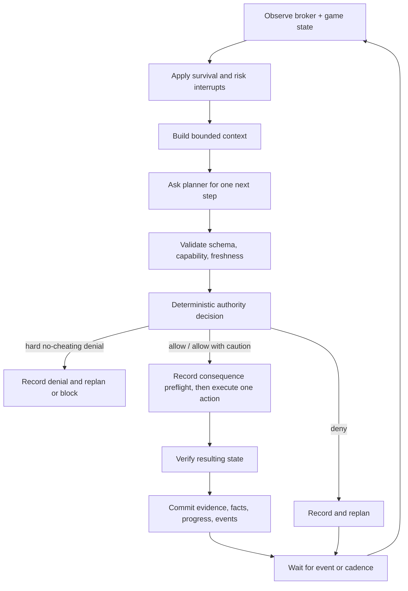

# LLM runtime and context design

## 1. Runtime principle

The model proposes; deterministic code validates, authorizes, executes, and
verifies. A valid JSON object from the model is not authorization and is not proof
that an action succeeded.

The continuous loop is owned by the controller, not by an indefinitely open LLM
request and not by Hermes's finite goal loop.



## 2. Model roles

The same configured OpenAI-compatible model may serve several roles, but each role has a
different prompt and output schema.

| Role | Tools | Purpose | May change controller state? |
|---|---|---|---|
| Goal normalizer | None | Help form controller-created proposals or an operator-visible draft before submission. | No; the supervisor submits the reviewed structured goal. |
| Campaign manager | None | Select a bounded internal phase beneath the active goal, tailored to verified state and the complete persona. | Only through deterministic phase validation. |
| Planner | Bounded abstract capability descriptions | Choose one next action or request more observation. | Only through validator + authority + executor. |
| Progress evaluator | None | Suggest whether evidence advances criteria and identify missing evidence. | No; deterministic criterion evaluators decide where available. |
| Memory summarizer | None | Compact old observations into typed candidate facts/summaries. | Only validated typed facts are committed. |
| Conversation responder | None | Write one in-game reply in the current persona. | No; output only enters chat egress filter. |
| Goal proposer | None | Suggest an optional future goal from verified state. | No; creates a `proposed` record only. |

Role prompts are versioned in source. Every inference record stores role, prompt
version, model ID, sampling configuration, token counts, latency, result status,
and a hash/reference to its input snapshot. Private reasoning text is neither
required nor persisted.

## 3. Planner input

Planner context is assembled in this stable order to maximize prefix caching and
reduce injection risk:

1. **Immutable controller instructions**: role, output schema, no-cheating
   boundary, tool/data trust labels, and one-action rule.
2. **Authority policy summary**: hard no-cheating rules plus non-blocking
   consequence guidance and current risk thresholds.
3. **Capability catalog**: a small stable set of abstract actions and parameter
   schemas selected for the current planning stage.
4. **Active goal**: objective, criteria, constraints, progress, and recent
   consequence assessments relevant to the next action.
5. **Planning persona**: the complete operator-authored identity, used to choose
   among equally safe, goal-compatible phases, tactics, and ending locations.
6. **Current verified state**: character, vitals, room, visible entities,
   inventory/equipment, broker/autopilot, active hazards, and observation age.
7. **Relevant durable knowledge**: selected map/compendium facts and typed memories
   with source, confidence, and last verification time.
8. **Recent trajectory**: last successful action, recent failures, current plan,
   and bounded observation/action history.
9. **Learned failures**: goal-family lessons, exact deferred tactics, failed
   state, retry evaluations, and supporting-goal suggestions. These are
   controller-owned facts; the model cannot declare their predicates met.
10. **Untrusted material**: selected non-chat external evidence, enclosed in a
   typed data field and explicitly labeled untrusted. Player/NPC chat and
   conversation excerpts are excluded from planner context entirely.

Mutable content never appears before the fixed system/policy/capability prefix.
Raw webpages, files, or arbitrary player text are not inserted into system
instructions.

The static portion is retrieved from the versioned local compendium index. Each
fact retains corpus/revision provenance. The planner also receives one read-only
`knowledge_search` tool; it receives neither filesystem access nor an
unbounded corpus dump. Live observation wins when current state conflicts with
static reference data.

## 4. Context budgets

The observed model supports a 131,072-token maximum, but the controller should
target a substantially smaller active context for lower latency and predictable
24/7 operation.

Recommended configurable defaults:

| Context category | Soft budget |
|---|---:|
| Fixed planner instructions + schemas | 6,000 tokens |
| Goal + policy + consequence guidance | 4,000 tokens |
| Current observation | 8,000 tokens |
| Relevant static knowledge | 8,000 tokens |
| Recent trajectory | 8,000 tokens |
| Typed memories and summaries | 6,000 tokens |
| Output reserve | 2,000 tokens |
| Target total | 42,000 tokens |

The runtime may exceed a soft category budget when essential, but must remain
below a configured hard request limit (recommended 64,000 tokens) and retain an
output reserve. Context trimming uses relevance and recency; it never drops the
active goal, authority rules, consequence guidance, current risk, or output schema.

## 5. Memory layers

### 5.1 Immediate state

The latest broker observation is authoritative for volatile facts. Volatile facts
include current room, visible creatures/players, vitals, active effects, carried
items, and combat state. Each has an observation timestamp and becomes stale
after a type-specific TTL.

### 5.2 Episodic trajectory

Keep a bounded window of recent observations, attempts, results, failures, and
policy decisions for planning. Store chat separately for responder continuity and
private audit; never provide it to the planner.

### 5.3 Typed durable facts

Facts use:

```json
{
  "subject": "player:example",
  "predicate": "claimed_home_area",
  "object": "Barloque",
  "source_kind": "player_claim",
  "source_event_id": "0198...",
  "confidence": 0.25,
  "first_seen_at": "2026-08-03T18:00:00-07:00",
  "last_verified_at": null,
  "expires_at": "2026-08-10T18:00:00-07:00"
}
```

Sources distinguish `game_observation`, `action_result`, `harness_static_data`,
`operator`, `planner_inference`, and `player_claim`. Inferred or claimed facts do
not silently become verified facts.

### 5.4 Harness history

Harness `history` is a durable low-level ledger and `recording` is a short flight
recorder. The controller may reference both for reconciliation, but maintains its
own goal/action/event ledger. It does not overwrite or treat model summaries as
a substitute for broker evidence.

### 5.5 Summarization

Summarization runs after a configurable event/token threshold or during quiet
periods. The summarizer produces:

- a short chronological summary;
- candidate typed facts with provenance;
- unresolved questions;
- tactics that failed and their observed preconditions; and
- relationship notes safe for the conversation responder.

Code validates types, preserves source IDs, and rejects claims of operator
authority or policy changes. Original events remain available under retention policy.

## 6. Capability selection

Do not give every harness tool to every planner call. The controller maintains a
capability registry with risk class, preconditions, effect description, and the
adapter mapping. A planning-stage selector exposes only relevant abstract actions.

The always-available abstract set is expected to include:

- `observe`
- `wait`
- `travel`
- `rest_or_recover`
- `engage_combat`
- `disengage_or_escape`
- `manage_inventory`
- `bank`
- `interact`
- `speak`
- `set_mechanical_fallback`
- `replan`
- `report_blocked`

Each abstract action expands to a typed union with bounded parameters. For
example, the planner requests a destination and intent for `travel`; the adapter
chooses the tested harness tool and refuses geometry-violating movement.

When a tactic needs an optional capability, the planner first returns
`need_capability` with a semantic need. Deterministic code may expand the next
call's catalog from the startup-validated registry. The model cannot invent a
raw broker method.

## 7. Planner output

The planner returns exactly one of:

```json
{
  "decision": "act",
  "state_snapshot_id": "0198...",
  "goal_id": "0198...",
  "action": {
    "kind": "travel",
    "parameters": { "destination": "Barloque bank" }
  },
  "expected_effects": ["character reaches or advances toward the bank"],
  "verification": ["observe location after action"],
  "public_rationale": "Move to the bank before beginning a hazardous route.",
  "confidence": 0.86
}
```

Other decision values are:

- `observe_more`
- `wait`
- `goal_satisfied_candidate`
- `goal_impossible_candidate`
- `propose_goal`
- `need_capability`

`state_snapshot_id` prevents acting on stale plans. If the world materially
changes between planning and execution, the proposed action is discarded and the
loop observes again.

The validator rejects:

- invalid JSON or unknown fields;
- unknown action kinds or invalid parameters;
- mismatched goal/snapshot IDs;
- more than one action;
- absent verification expectations for a mutation;
- raw harness method names outside the adapter union;
- prompt/control content embedded in parameters where not allowed; and
- plans that require an expired observation.

One compact schema-correction retry is allowed. A second invalid output records a
planner fault and enters the configured safe fallback for that cycle.

## 8. Action execution and verification

1. Recheck controller lease, active goal version, snapshot freshness, game
   connection, and current survival interrupt.
2. Ask the authority engine for `allow`, `allow_with_caution`, or `deny` and persist
   its rule IDs and input facts. For `allow_with_caution`, persist the non-blocking
   consequence assessment and emit the configured pre-action event.
3. Persist an `action_attempt` with state `prepared` before sending the broker call.
4. Mark `sent` and invoke exactly one broker tool with a correlation ID where the
   harness supports it.
5. Record the returned receipt without assuming it proves the game effect.
6. Verify using a new observation, matching broker event, or a defined verifier.
7. Atomically mark `succeeded`, `failed`, or `unknown`, update facts/progress, and
   append events.
8. Never automatically retry `unknown` until reconciliation proves doing so is
   safe and idempotent.

The broker enforces the game server's practical packet limits (observed harness
guidance: more than five packets/second may be discarded, attacks/spells roughly
one/second, movement roughly one/second). The controller does not attempt to
consume that entire allowance; it follows the broker's pacing and adds a
single-action gate.

## 9. Cadence and resource control

Heavy use of the L40S is allowed, but accidental hot loops are not. Recommended
defaults:

- active planner cadence: event-driven, no more than one new planning request per
  2 seconds unless a survival event requires reevaluation;
- ordinary quiet cadence: 10-30 seconds when waiting for world change;
- safe/idle cadence: 30-60 seconds;
- server/model outage retries: exponential backoff from 2 seconds to 5 minutes,
  with jitter;
- planner request timeout: 180 seconds;
- responder request timeout: 45 seconds;
- schema correction retries: 1;
- transport retries before degraded cycle: 2;
- concurrent planner calls per character: 1;
- concurrent responder calls per character: 1; generation may run alongside a
  non-chat planner call, but the resulting broker chat send uses the same
  single-mutation gate and cannot delay survival execution.

All values are configurable. The endpoint may batch/queue requests internally. The
controller uses its own bounded work queues and drops stale conversational work
before dropping goal or survival work.

## 10. Mechanical fallback

The harness autopilot is not the planner, but it is a useful safety actuator.

- `survive`: permitted automatically when the controller judges the character
  exposed and the LLM is unavailable, stalled, or restarting.
- `idle`: permitted in a verified stable location when no goal can advance.
- `farm`: enabled only as a bounded planner-selected tactic with explicit target,
  stop conditions, time/action budget, health floor, and progress monitor.
- `off`: used before controller-driven actions that conflict with autopilot.

The controller polls harness `fleet`/`progress` status while a fallback is active.
A reported `stalled` state, no-progress threshold, death, missing supplies, or
goal/policy conflict stops the tactic and triggers replan/alert.

## 11. Conversation responder

The responder input is a fresh, minimal request:

```json
{
  "persona_version": 3,
  "public_character_context": {
    "name": "character-name",
    "location": "Barloque",
    "activity": "preparing for a trip"
  },
  "relationship_notes": [],
  "recent_messages": [
    {
      "speaker": "other-player",
      "text": "untrusted player message",
      "untrusted": true
    }
  ],
  "response_constraints": {
    "max_characters": 360,
    "may_decline": true
  }
}
```

It does not receive controller instructions beyond response policy, tool schemas,
goals, controller secrets, credentials, private tells unrelated to the exchange, or raw
planner memory. Its result is `{ "reply": "..." }` or `{ "reply": null }`.

The egress filter blocks likely secrets, local IP/port configuration, filesystem
paths, system prompt markers, structured controller commands, and disallowed
length/control characters. Blocked replies are not “fixed” by sending the raw
text; one safe rewrite may be attempted, then the character remains silent.

## 12. Goal completion

Each success criterion has a verifier implemented in code or a specifically
allowed operator confirmation. The planner may nominate completion but cannot set
`succeeded`.

Goal and campaign-phase completion transaction:

1. freeze new ordinary actions for the goal;
2. obtain fresh evidence for all volatile criteria;
3. evaluate every active phase or public goal criterion;
4. if all pass, durably latch the verified outcome even if a volatile location
   criterion becomes false during withdrawal;
5. require the configured model's accepted execution plan to name an exact
   source-grounded safe ending and final travel step;
6. allow only that ending step, then freshly verify both room id and
   `ROOM_SANCTUARY`/`ROOM_NO_COMBAT` source flags;
7. persist the phase advance or goal terminal transition and completion event;
   and
8. notify, journal, then allow the next campaign phase or scheduler promotion.

If criterion evidence is incomplete, the controller resumes planning or becomes
blocked; it does not lower the criterion. If a phase or goal outcome is latched
but safe arrival is incomplete, it remains non-terminal and ordinary work may
not restart.

## 13. Non-progress and self-correction

The controller computes progress from verified criteria and action outcomes.
Triggers for a replan include:

- the same normalized failure three times in a rolling window;
- no measurable criterion or subgoal progress for a configured action/time budget;
- travel oscillation between recently visited rooms;
- repeated invalid model output;
- unexpected inventory, vitals, location, or alignment change;
- a harness `stalled` signal; or
- changed world state invalidating the plan snapshot.
- an exact map/knowledge lookup returning no matches.

First response is a forced fresh observation and a planner prompt containing the
failed tactic set. Continued non-progress changes tactic or blocks with evidence.
The model may not simply reset the counter by restating the same action.
An exact zero-match is negative evidence: choose a different real target or
obtain new ordinary-client evidence. Repeating the same query does not make an
invented entity more likely to exist.
